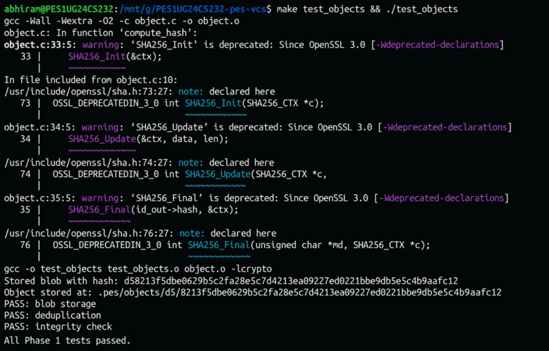
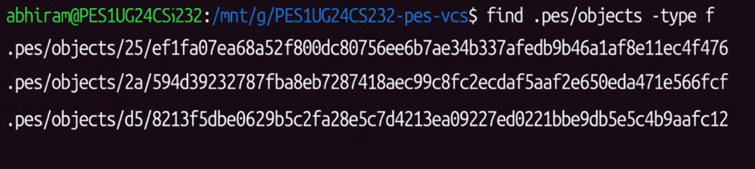
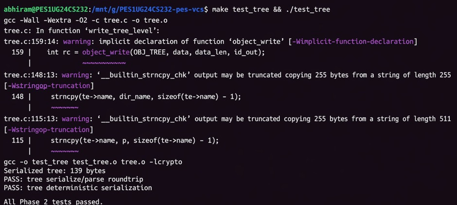
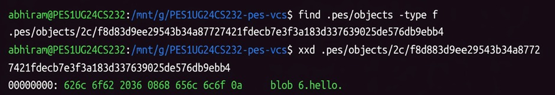
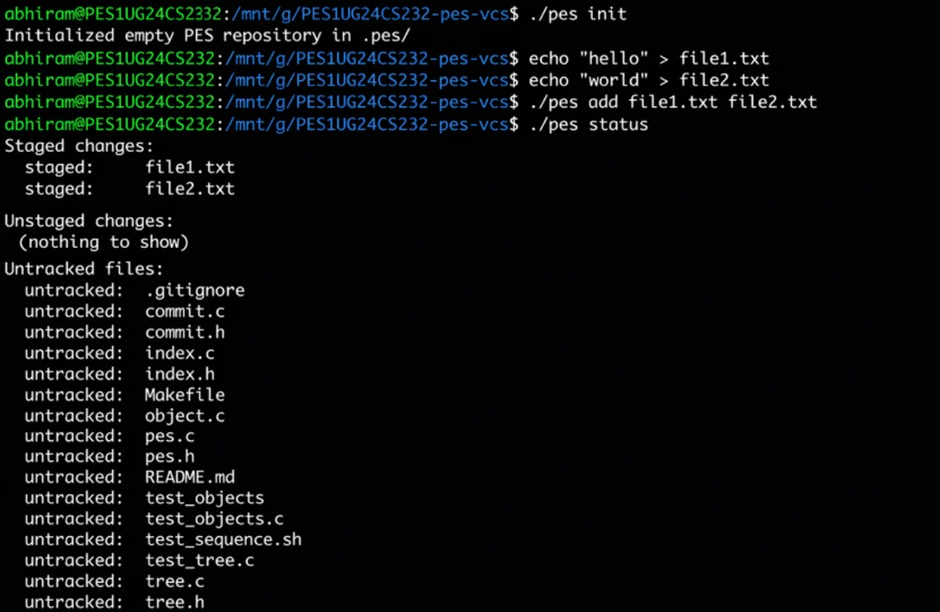
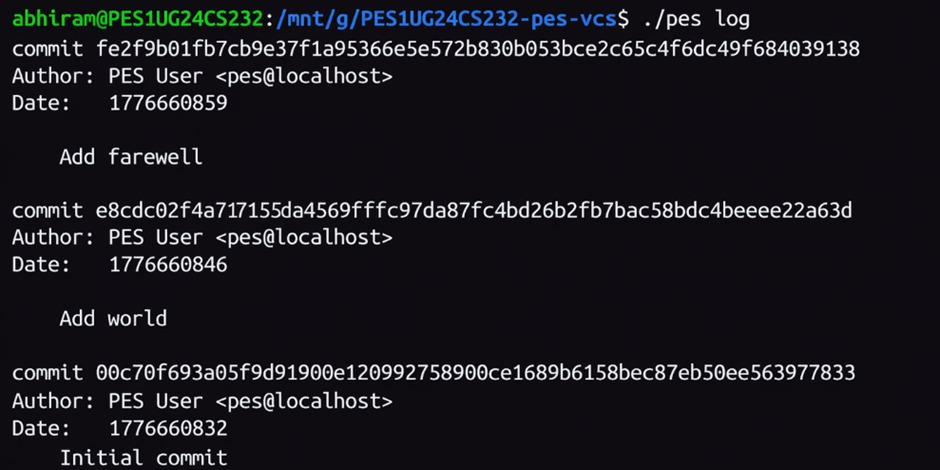
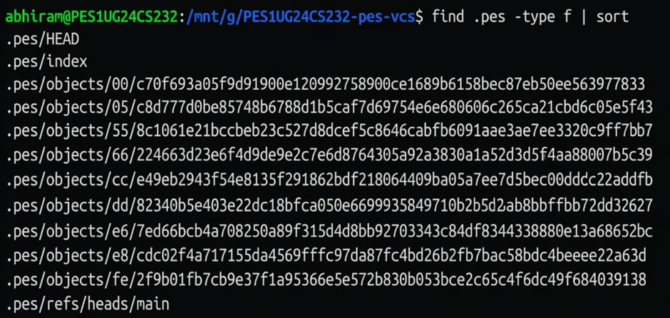
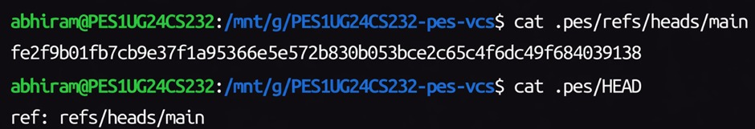
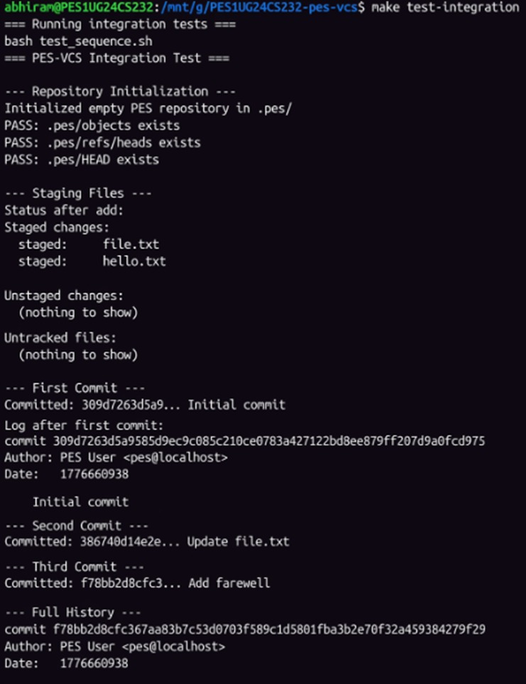

# PES-VCS Lab Report

**Name:** Abhiram
**SRN:** PES1UG24CS232
**Repository:** [PES1UG24CS232-pes-vcs](https://github.com/Abhiram0856/PES1UG24CS232-pes-vcs)

---

## 📌 Overview

This project implements a basic **Version Control System (VCS)** in C.
It demonstrates how files are tracked, stored, and managed similar to systems like Git.

---

## 🎯 Features

* Object storage using hashing (SHA-256)
* File indexing system
* Commit tracking
* Version management
* File integrity verification

---

## 🛠️ Technologies Used

* C Programming
* File Handling
* Makefile

---

## 📂 Project Structure

```
.
├── commit.c
├── commit.h
├── index.c
├── index.h
├── Makefile
├── README.md
└── images/
```

---

## ⚙️ How to Run

### 1️⃣ Clone the repository

```bash
git clone https://github.com/Abhiram0856/PES1UG24CS232-pes-vcs.git
cd PES1UG24CS232-pes-vcs
```

### 2️⃣ Compile

```bash
make
```

### 3️⃣ Run

```bash
./a.out
```

---

## 🧪 Implementation Details

### Phase 1: Object Storage

* `object_write` → Creates object, computes SHA-256, stores in `.pes/objects/`
* `object_read` → Reads object, verifies hash, returns data

### Phase 2: Indexing

* Tracks files added to system
* Maintains index file
* Updates file states

### Phase 3: Commit System

* Creates commits with metadata
* Maintains commit history
* Links objects and changes

---

## 📸 Screenshots

<p align="center">
  
  
</p>

<p align="center">
  
  
</p>

<p align="center">
  
  
</p>

<p align="center">
  
  
  
</p>

---

## 📖 Screenshot Description

* **1A–1B:** Object creation and storage
* **2A–2B:** Indexing and file tracking
* **3A–3B:** Commit creation
* **4A–4C:** Final output and verification

---

## 🚀 Future Improvements

* Add branching functionality
* Improve user interface
* Add rollback support
* Optimize storage efficiency

---

## 👨‍💻 Author

Abhiram
PES1UG24CS232

---
